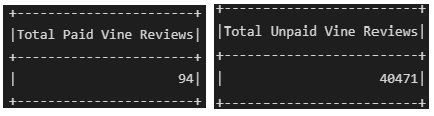
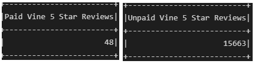
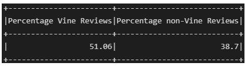
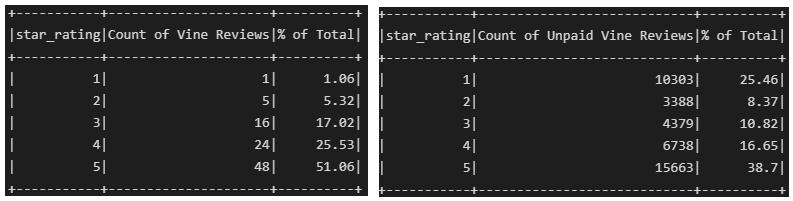

# Amazon_Vine_Analysis

## Table of Contents
- [Overview of Project](#OverviewProject)
  * [Background](#Background)
  * [Purpose](#purpose)
- [Results](#results)
- [Analysis Summary](#Summary)
- [Resources](#resources)

## Overview of Project
### Background

The Amazon Vine program is a service that allows manufacturers and publishers to receive reviews for their products. Various companies pay a small fee to Amazon and provide products to Amazon Vine members, who are then required to publish a review. In this project we will analyze Amazon reviews for one of the product category.  

Here is the link to read more about [Amazon Vine Program](#https://www.amazon.com/vine/about). 

### Purpose

The purpose of this project is to analyze Amazon reviews for Video Games. I am using PySpark to perform the ETL process to extract the dataset, transform the data, connect to an AWS RDS instance, and load the transformed data into pgAdmin. We will use PySpark to determine if there is any bias toward favorable reviews from Vine members in the dataset of video games .
 
## Results

In this analysis, I have retrieved the data where the total votes are greater than 20 and the percentage of helpful votes is equal to or greater than 50. This is done to pick reviews that are more likely to be helpful and to avoid having division by zero errors later on.

Total number of Paid Vine reviews:- **94**  
Total number of Unpaid Vine reviews:- **40471**

  
  

Total number of Paid 5-star Vine reviews:- **48**  
Total number of Unpaid 5-star Vine reviews:- **15663**

  
  

% of Paid 5-star Vine reviews:- **51.06**  
% of Unpaid 5-star Vine reviews:- **38.7**

  
  

## Analysis Summary

***51%*** of the reviews in the Vine program were 5 stars reviews whereas the percentage in the **non-Vine reviews is only *39%***. The percentage of 5 star reviews for the Vine program are 12% higher as comared to the non Vine program. **Hence from this analysis I concude that there is a positivity bias for reviews in the Vine program.**

I have also analyzed the data for all star reviews. From the table below we can see that there is a positivity bias for 3-Star, 4-Star and 5-Star reviews. Below is the result table:

  
  

 <i>All Star reviews table</i> 

##  Resources
[1] [Amazon Vine Reviews for Video Games](#https://s3.amazonaws.com/amazon-reviews-pds/tsv/amazon_reviews_us_Video_Games_v1_00.tsv.gz)  
[2] [Amazon Reviews ETL Code](#Amazon_Reviews_ETL.ipynb)  
[3] [Vine Review Analysis](#Vine_Review_Analysis.ipynb)

[2] Language:
* pySpark  

[3] Software: 
* Google Colab  
* PgAdmin
* AWS
 